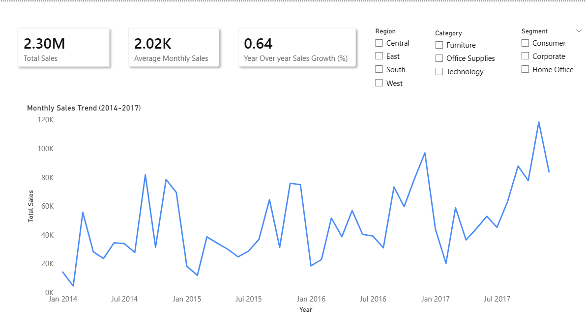

#  Sales Forecasting & Business Insights  
**Time Series Analysis • Machine Learning • Power BI Dashboard**

---

##  Project Overview
This project presents an **end-to-end sales analytics and forecasting solution** using historical retail data.  
It combines **time series feature engineering**, **machine learning models**, and an **interactive Power BI dashboard** to deliver actionable business insights.

The workflow follows a **real-world data analytics pipeline**:
Data preparation → Feature engineering → Forecasting → Business reporting.

---

##  Business Objectives
- Analyze historical sales trends and seasonality
- Identify growth patterns and volatility over time
- Forecast future monthly sales
- Present insights through an executive-level dashboard

---

##  Tools & Technologies
- **Python** (Pandas, NumPy, Matplotlib)
- **Scikit-learn** (Linear Regression, Random Forest)
- **Time Series Feature Engineering**
- **Power BI** (DAX, KPIs, Forecasting)
- **Git & GitHub**

---

##  Project Structure
```
├── notebooks/
│   ├── 1_eda_time_series.ipynb
│   ├── 2_feature_engineering.ipynb
│   └── 3_modeling_forecasting.ipynb
│
├── data/
│   └── monthly_sales_features.csv
|   └── Sample-Superstore.csv
│
├── powerbi/
│   └── Sales_Analysis_Dashboard.pbix
│
├── screenshots/
│   ├── executive_overview.png
│   ├── time_series_analysis.png
│   ├── forecasting_page.png
│   ├── ml_actual_vs_predicted.png
│   └── feature_engineering_table.png
│
└── README.md
```
---

##  Data Preparation
- Loaded retail sales dataset
- Converted date columns to proper datetime format
- Aggregated sales at **monthly level**
- Ensured clean and consistent time series structure

---

##  Feature Engineering (Time Series)
To capture temporal behavior, the following features were created:

### Lag Features
- `lag_1`, `lag_2`, `lag_3` → previous months’ sales

### Rolling Statistics
- `rolling_mean_3` → 3-month moving average
- `rolling_mean_6` → 6-month moving average

These features help models learn **trend momentum and seasonality**.

---

##  Machine Learning Models
Two regression models were trained and compared:

### 1️ Linear Regression
- Baseline, interpretable model
- Captures overall trend in sales

### 2️ Random Forest Regressor
- Handles non-linear patterns
- Better at modeling sales volatility

### Model Validation
- Time-based train–test split (no data leakage)
- Performance evaluated using regression metrics
- Visual comparison using **Actual vs Predicted** plots

---

##  Key ML Insights
- Lag and rolling features significantly improved predictions
- Random Forest outperformed Linear Regression in fluctuating periods
- Sales show strong dependency on recent historical values

---

##  Power BI Dashboard
An interactive Power BI dashboard was created to communicate insights effectively.

### Dashboard Pages

### 🔹 Executive Overview
- Total Sales KPI
- Average Monthly Sales KPI
- Sales by Category and Region
- Sub-category contribution (Treemap)

### 🔹 Time Series Analysis
- Monthly sales trend
- Moving average smoothing
- Seasonal pattern identification

### 🔹 Forecasting
- Built-in Power BI forecast
- Future sales projection
- Confidence interval visualization

---
##  Dashboard Preview

### Executive Overview


### Time Series Analysis


### Sales Forecasting

 --- 

##  Business Insights
- Clear seasonal trends with year-end sales peaks
- Certain categories consistently drive higher revenue
- Forecast suggests stable long-term growth with short-term variability
- Moving averages help identify underlying sales trends

---

##  Key Takeaways
- Demonstrates a complete analytics and forecasting pipeline
- Combines machine learning with business intelligence
- Well-suited for **Data Analyst / Data Science / ML Intern** roles

---

##  Future Improvements
- Incorporate external variables (holidays, promotions)
- Experiment with advanced models (ARIMA, Prophet)
- Automate dashboard refresh using scheduled data updates

---

##  Author
**Senitha Gunathilaka**  
Aspiring Data Scientist | Data Analyst  

🔗 LinkedIn: https://www.linkedin.com/in/senitha-gunathilaka-404236285/  
🔗 GitHub: https://github.com/theHoodguy4587
